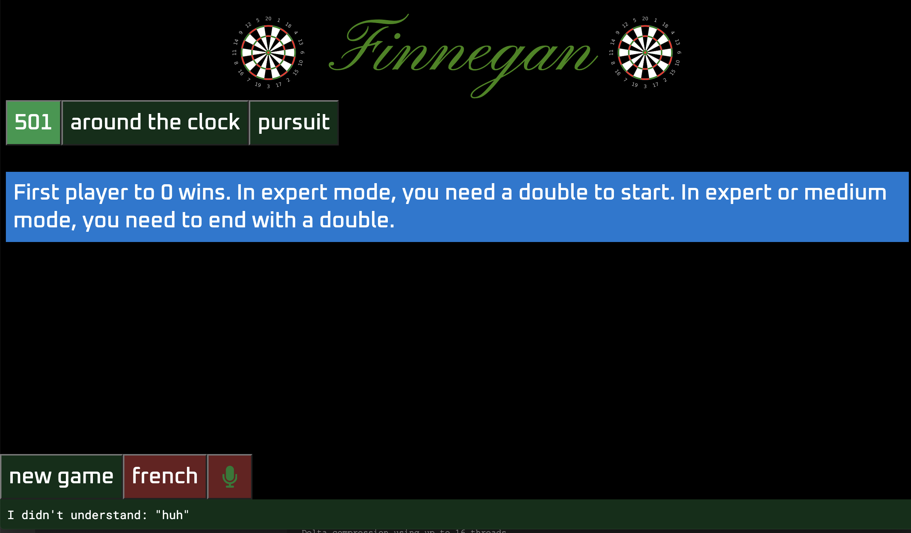
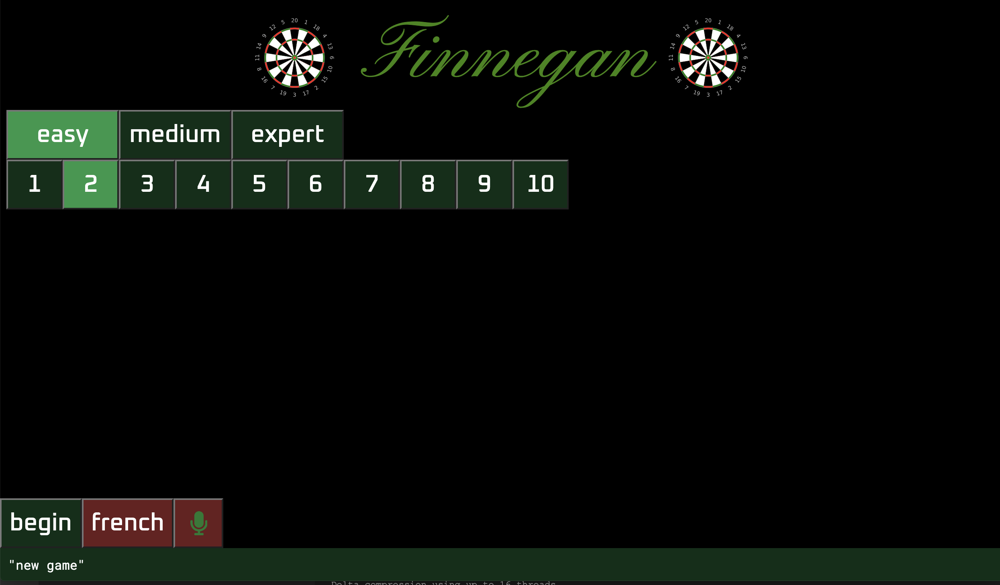
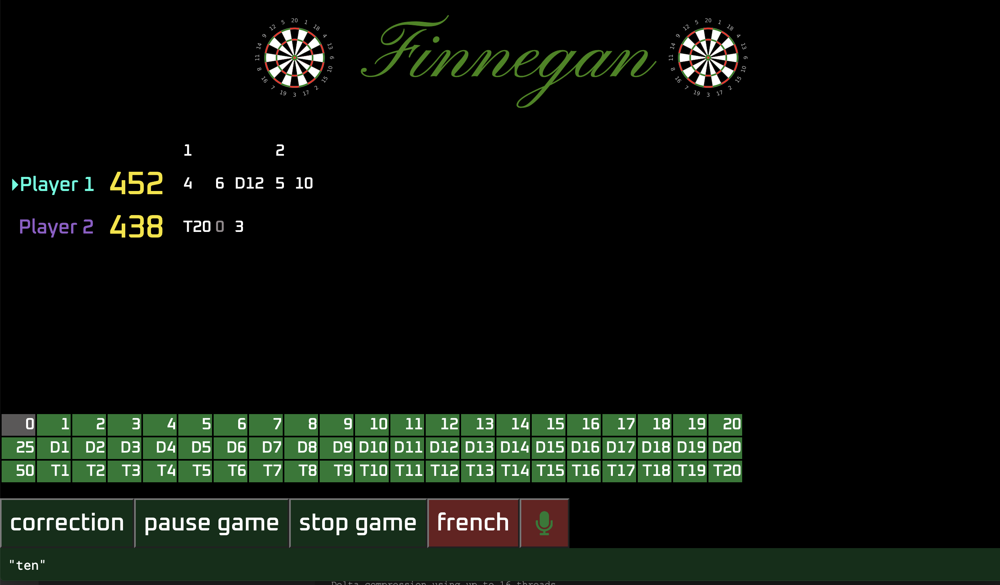

# finnegan

## What is it ?
This is a voice-controlled dart scoring system.
You talk out loud to the program and it keeps track of the score for you ! And it is completely offline:
no data transmitted anywhere for processing !

Here is what the UI looks like when you start the program for English:

<br/>

<br/>
<br/>

For each command, you can either click on a button or say out loud what is written on it. For
instance, if you say "new game" on the home screen while "501" is selected (like in the previous screenshot),
you can then configure the difficulty and number of players:

<br/>

<br/>
<br/>

Once you begin the game, you tell the program what each dart has scored like "three", "double eighteen" or "zero"
if you missed the board and it keeps the score for you:

<br/>

<br/>
<br/>

## Dependencies
To run this application, you need `python3` >= 3.6, `pip3` >= 10, and [deno](https://deno.land/#installation) >= 1.16.2.
On MacOS, you need to make sure the Terminal is allowed to access your microphone. 

<br/>

## How to run it
Run `./install_dependencies.sh ` to install the dependencies, i.e. the python modules and data models needed
to run the speech recognition tool.

Run `./finnegan en.json` to start the game engine in English.

Now you can either open `http://localhost:50301` in a web browser to access the web UI or just use the console output
that looks like this:
```
/---------------------------------------------------\
|  FINNEGAN - VOICE CONTROLLED DART SCORING SYSTEM  |
\---------------------------------------------------/

    501
 => Around the clock
    Pursuit

Hit all the numbers from 1 to 20 in ascending order. First player to hit 20 wins.

*****************************************
* Possible things to say:               *
*                                       *
* new game             Start a new game *
* 501                  501              *
* around the clock     Around the clock *
* pursuit              Pursuit          *
*                                       *
* french               Play in French   *
*****************************************

I didn't understand: "huh"
```

<br/>

## How does it work ?
The application is divided in two programs. A python program does the speech
recognition part and a typescript program takes care of the dart scoring as well
as acting as a game server. On top of it, an html page with plain javascript takes
care of rendering the games in a nicer way than just the console output.

<br/>

## The speech recognition part
`fart.py` is a generic tool that looks for patterns made of tokens, where each
token can be matched by several words like accepting "for" for the number "four".
The files `en.json` and `fr.json` contain the configurations needed to play
darts in English and French, which include a bit more that the pure speech
recognition configuration.

Have a look at the example file `vegetables_en.json` to see how you can make
your own configuration rules to do your own stuffs.

You can also have a look at the `search_with_your_voice.sh` script that does not
use any matching rules and works directly on the raw text output from the speech
recognition tool.

Both the unrecognized speech sequences and the patterns matched by the tool are emitted
on the standard output with a prefix specified in the configuration file.

<br/>

## The scoring part

The typescript program executed from `./finnegan` is the actual scoring system. It reads the output of
`fart.py` to fetch the commands and manages the scores. It is also acting as a server that can:
- serve the html page acting as a UI at `http://localhost:50301/`
- serve the game state as a json object at `http://localhost:50301/state`
- accept commands sent by POST requests to `http://localhost:50301/command` (used by the web UI to send
  commands when clicking on buttons instead of using voice recognition)
- accept websocket connections at `ws://localhost:50302`. Whenever the server state changes, the json
  object will be sent as a message to all connected websocket clients

For example, if you start the program with `./finnegan en.json` and then
do `curl http://localhost:50301/state`, you will get something like this:

```json
{
  "listening": true,
  "games": [
    "501",
    "AROUND_THE_CLOCK",
    "PURSUIT"
  ],
  "selectedGame": "AROUND_THE_CLOCK",
  "possibleThingsToSay": [
    {
      "command": "NEW_GAME",
      "textToSay": "new game",
      "description": "Start a new game"
    },
    {
      "command": "501",
      "textToSay": "501",
      "description": "501"
    },
    {
      "command": "AROUND_THE_CLOCK",
      "textToSay": "around the clock",
      "description": "Around the clock"
    },
    {
      "command": "PURSUIT",
      "textToSay": "pursuit",
      "description": "Pursuit"
    }
  ],
  "alternativeLanguages": [
    {
      "command": "LOAD_CONFIG:fr.json",
      "textToSay": "french",
      "description": "Play in French"
    }
  ],
  "messageForUser": "Hit all the numbers from 1 to 20 in ascending order. First player to hit 20 wins.",
  "lastPartOfSpeech": {
    "text": "around the clock"
  },
  "wsUrl": "ws://0.0.0.0:50302"
}
```

As you can see, the game state description also contains everything, including a description of the voice commands
that can be used in the current game state. You can find details about the game state by looking at the
types defined in `types.ts`.

<br/>
<br/>

## Credits
* https://alphacephei.com/vosk/: the awesome library that provides the engine for doing voice recognition
* https://freesvg.org/vector-illustration-of-dartboard
* https://commons.wikimedia.org/wiki/File:Font_Awesome_5_solid_microphone-slash.svg
* https://commons.wikimedia.org/wiki/File:Font_Awesome_5_solid_microphone.svg
